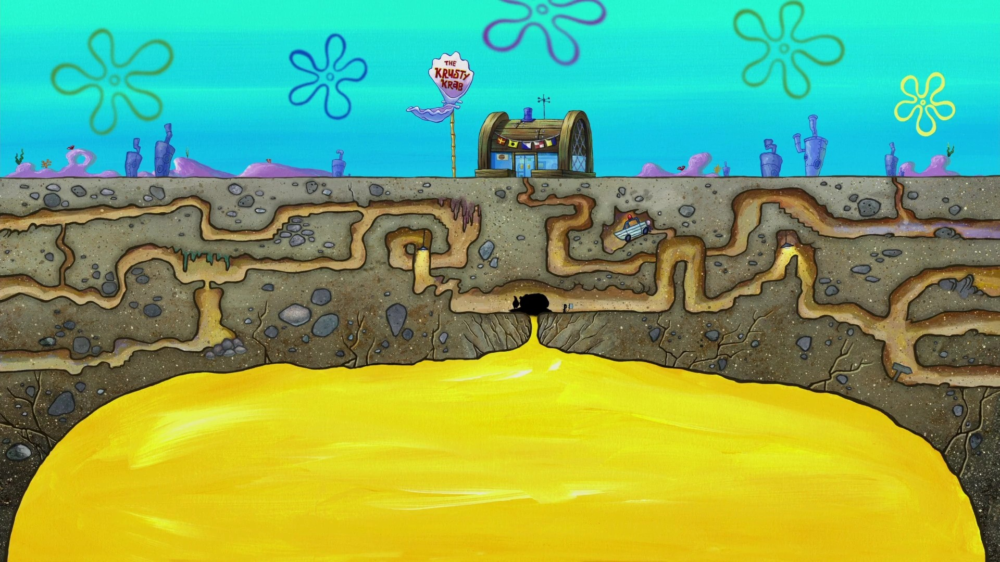
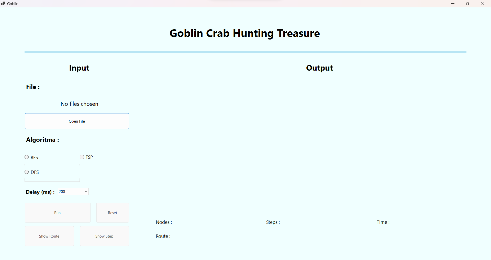
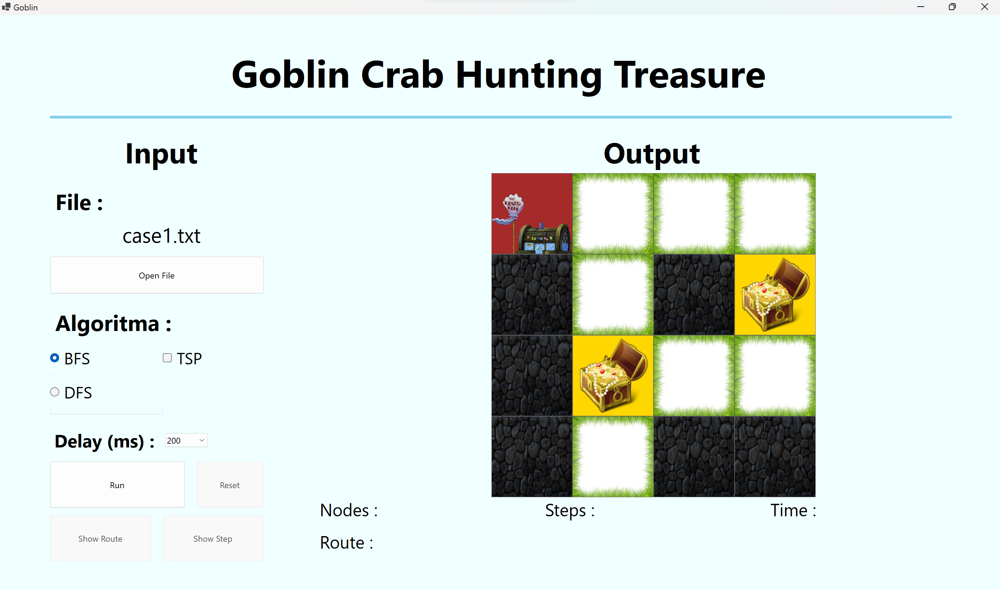
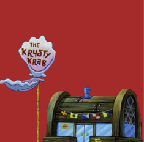
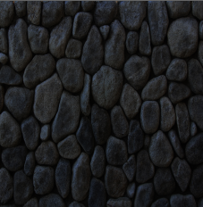

# Tubes2_Goblin

Tugas Besar II IF2211 Strategi Algoritma Semester II Tahun 2022/2023
<br>
Pengaplikasian Algoritma BFS dan DFS dalam Menyelesaikan Persoalan Maze Treasure Hunt

## Table of Contents

- [General Information](#general-information)
- [Program Display](#program-display)
- [How To Run](#how-to-run)
- [Tech Stack](#tech-stack)
- [Project Structure](#project-structure)
- [Credits](#credits)

## General Information

Tuan Krabs menemukan sebuah labirin distorsi terletak tepat di bawah Krusty Krab bernama El Doremi yang Ia yakini mempunyai sejumlah harta karun di dalamnya dan tentu saja Ia ingin mengambil harta karunnya. Dikarenakan labirinnya dapat mengalami distorsi, Tuan Krabs harus terus mengukur ukuran dari labirin tersebut. Oleh karena itu, Tuan Krabs banyak menghabiskan tenaga untuk melakukan hal tersebut sehingga Ia perlu memikirkan bagaimana caranya agar Ia dapat menelusuri labirin ini lalu memperoleh seluruh harta karun dengan mudah.



Setelah berpikir cukup lama, Tuan Krabs tiba-tiba mengingat bahwa ketika Ia berada pada kelas Strategi Algoritma-nya dulu, Ia ingat bahwa Ia dulu mempelajari algoritma BFS dan DFS sehingga Tuan Krabs menjadi yakin bahwa persoalan ini dapat diselesaikan menggunakan kedua algoritma tersebut. Akan tetapi, dikarenakan sudah lama tidak menyentuh algoritma, Tuan Krabs telah lupa bagaimana cara untuk menyelesaikan persoalan ini dan Tuan Krabs pun kebingungan. Tidak butuh waktu lama, Ia terpikirkan sebuah solusi yang brilian. Solusi tersebut adalah meminta mahasiswa yang saat ini sedang berada pada kelas Strategi Algoritma untuk menyelesaikan permasalahan ini.

## Program Display

### Tampilan awal program



### Tampilan program dengan maze



### Program Components

| Components                          | Explanation                                   |
| ----------------------------------- | --------------------------------------------- |
|  | Krusty Krab, refer to 'K' in textfile         |
|   | Accessible Path , refer to 'R' in textfile    |
|     | Treasure , refer to 'T' in textfile           |
|        | Non-accesible Path , refer to 'X' in textfile |

## How To Run

### Build and Run Program (recommended)

1. Clone or download this repository

```shell
https://github.com/Jimly-Firdaus/Tubes2_Goblin.git
```

2. Open terminal at root folder, run:

```shell
run.bat
```

### Run executable file

1. Clone or download this repository

```shell
https://github.com/Jimly-Firdaus/Tubes2_Goblin.git
```

2. Open terminal at root folder, run:

```shell
cd bin/Debug/net6.0-windows/
Goblin.exe
```

## Tech Stack

- C# 4.5.0
- Windows Form Application (.NET Framework 6.0)

## Project Structure

```bash
.
│   README.md
│   run.bat
│   .gitignore
│
├─── assets
│
├─── bin
│
├─── doc
│
├─── src
│        Goblin.cs
│        Goblin.csproj
│        Goblin.csproj.user
│        Goblin.sln
│        GoblinForm.Designer.cs
│        GoblinForm.cs
│        Program.cs
│        SolveMaze.cs
│        Utility.cs
│
└─── test
```

## Author

| NIM      | Name          | GitHub                                            |
| -------- | ------------- | ------------------------------------------------- |
| 13521046 | Jeffrey Chow  | [JeffreyChow19](https://github.com/JeffreyChow19) |
| 13521102 | Jimly Firdaus | [Jimly-Firdaus](https://github.com/Jimly-Firdaus) |
| 13521054 | Wilson Tansil | [Tansil011019](https://github.com/Tansil011019)   |
